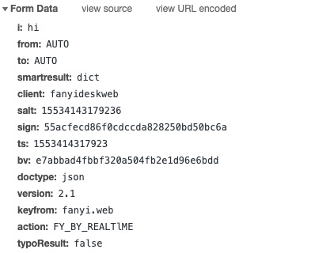

```shell
curl 'http://fanyi.youdao.com/translate_o?smartresult=dict&smartresult=rule' -H 'Cookie: OUTFOX_SEARCH_USER_ID=1801762453@10.169.0.83; JSESSIONID=aaaoN52M5XO4LeruxPUMw; OUTFOX_SEARCH_USER_ID_NCOO=1357451820.7115252; ___rl__test__cookies=1553414317913' -H 'Origin: http://fanyi.youdao.com' -H 'Accept-Encoding: gzip, deflate' -H 'Accept-Language: zh-CN,zh;q=0.9' -H 'User-Agent: Mozilla/5.0 (Macintosh; Intel Mac OS X 10_14_2) AppleWebKit/537.36 (KHTML, like Gecko) Chrome/73.0.3683.86 Safari/537.36' -H 'Content-Type: application/x-www-form-urlencoded; charset=UTF-8' -H 'Accept: application/json, text/javascript, */*; q=0.01' -H 'Referer: http://fanyi.youdao.com/' -H 'X-Requested-With: XMLHttpRequest' -H 'Connection: keep-alive' --data 'i=hi&from=AUTO&to=AUTO&smartresult=dict&client=fanyideskweb&salt=15534143179236&sign=55acfecd86f0cdccda828250bd50bc6a&ts=1553414317923&bv=e7abbad4fbbf320a504fb2e1d96e6bdd&doctype=json&version=2.1&keyfrom=fanyi.web&action=FY_BY_REALTlME&typoResult=false' --compressed
```
Result:
```
{"translateResult":[[{"tgt":"嗨","src":"hi"}]],"errorCode":0,"type":"en2zh-CHS","smartResult":{"entries":["","int. 嗨！（表示问候或用以唤起注意）\r\n","n. (Hi)人名；(柬)希\r\n"],"type":1}}% 
```


```js
function l(e, t) {
    if (O.state.originalText = e.i, "first" == e.action) return s(global.translatedJson), void t();
    h && (h.abort(), h = null), h = f.ajax({
        type: "POST",
        contentType: "application/x-www-form-urlencoded; charset=UTF-8",
        url: "translate_o?smartresult=dict&smartresult=rule",
        data: e,
        dataType: "json",
        success: function (e) {
            s(e), t && t()
        },
        error: function (e) {}
    })
} 
```

 data: e


```js
d.isWeb(n) ? o() : l({
    i: n,
    from: C,
    to: S,
    smartresult: "dict",
    client: k,
    salt: r.salt,
    sign: r.sign,
    ts: r.ts,
    bv: r.bv,
    doctype: "json",
    version: "2.1",
    keyfrom: "fanyi.web",
    action: e || "FY_BY_DEFAULT",
    typoResult: !1
}, t)
```


```js
var r = function (e) {
    var t = n.md5(navigator.appVersion),
        r = "" + (new Date).getTime(),
        i = r + parseInt(10 * Math.random(), 10);
    return {
        ts: r,
        bv: t,
        salt: i,
        sign: n.md5("fanyideskweb" + e + i + "1L5ja}w$puC.v_Kz3@yYn")
    }
};
```

* salt : 时间戳 + 随机数字
* sign : 签名
* ts : 时间戳
* bv : 浏览器版本md5 hash

借用postman测试并生成python3代码： (ip已被隐去)
```python
import requests

url = "http://fanyi.youdao.com/translate_o"

querystring = {"smartresult":["dict","rule"]}

payload = "i=hi&from=AUTO&to=AUTO&smartresult=dict&client=fanyideskweb&salt=15534143179236&sign=55acfecd86f0cdccda828250bd50bc6a&ts=1553414317923&doctype=json&version=2.1&keyfrom=fanyi.web&action=FY_BY_REALTlME&typoResult=false"
headers = {
    'Cookie': "OUTFOX_SEARCH_USER_ID=1801762453@xx.xxx.xx.xx; JSESSIONID=aaaoN52M5XO4LeruxPUMw; OUTFOX_SEARCH_USER_ID_NCOO=1357451820.7115252; ___rl__test__cookies=1553414317913",
    'Content-Type': "application/x-www-form-urlencoded; charset=UTF-8",
    'Referer': "http://fanyi.youdao.com/",
    'User-Agent': 'Mozilla/5.0 (Macintosh; Intel Mac OS X 10_14_2) AppleWebKit/537.36 (KHTML, like Gecko) Chrome/73.0.3683.86 Safari/537.36',
    }

response = requests.request("POST", url, data=payload, headers=headers, params=querystring)

print(response.text)
```


